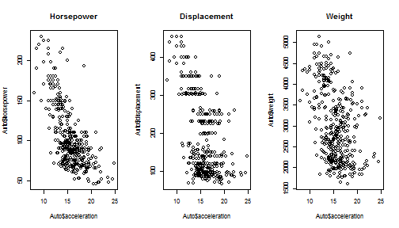

## Predicting Car Acceleration

#### A Random Forest Prediction Exercise

for the Johns Hopkins Bloomberg School of Public Health

Data Science Specialization -- Developing Data Products

via Coursera.org

May 2015

---

## What does it do?

This [Shiny App](https://kawenks.shinyapps.io/JHBSPH_DevDataProd) uses the [Auto](http://www.inside-r.org/packages/cran/ISLR/docs/Auto) dataset in the [ISLR](http://cran.r-project.org/web/packages/ISLR/ISLR.pdf) package. It sets up a Random Forest prediction model to determine a car's acceleration based on several attributes.  

---

## Data Exploration - Auto dataset

1. 392 observations (vs. 32--mtcars), 9 variables (vs. 11--mtcars). 
2. 2 numeric variables (year, origin) that should be ordinal
3. 3 variables have relatively higher correlation to acceleration

 

---

## The prediction model

Feature Selection and Cross Validation Fine-Tuning

* horsepower  
* displacement  
* weight  
* cylinders

&nbsp;

Fine-tune with 10-fold cross validation

---

## Sample Error Rate

Random Forest has lower RMSE and explains more of the data variability.

<!-- html table generated in R 3.1.1 by xtable 1.7-4 package -->
<!-- Sat May 23 14:54:36 2015 -->
<table class=ErrRateTbl>
<tr> <th>  Model  </th> <th>  RMSE  </th> <th>  $R^2$  </th> <th>  RMSE sd  </th> <th>  $R^2$ sd  </th>  </tr>
  <tr> <td> Random Forest </td> <td align="center"> 1.4171 </td> <td align="center"> 0.7508 </td> <td align="center"> 0.2087 </td> <td align="center"> 0.0730 </td> </tr>
  <tr> <td> Bayesian Generalized Linear Model </td> <td align="center"> 1.5208 </td> <td align="center"> 0.7210 </td> <td align="center"> 0.2411 </td> <td align="center"> 0.0970 </td> </tr>
  <tr> <td> Generalized Additive Model </td> <td align="center"> 1.4838 </td> <td align="center"> 0.7121 </td> <td align="center"> 0.1437 </td> <td align="center"> 0.0850 </td> </tr>
   </table>

